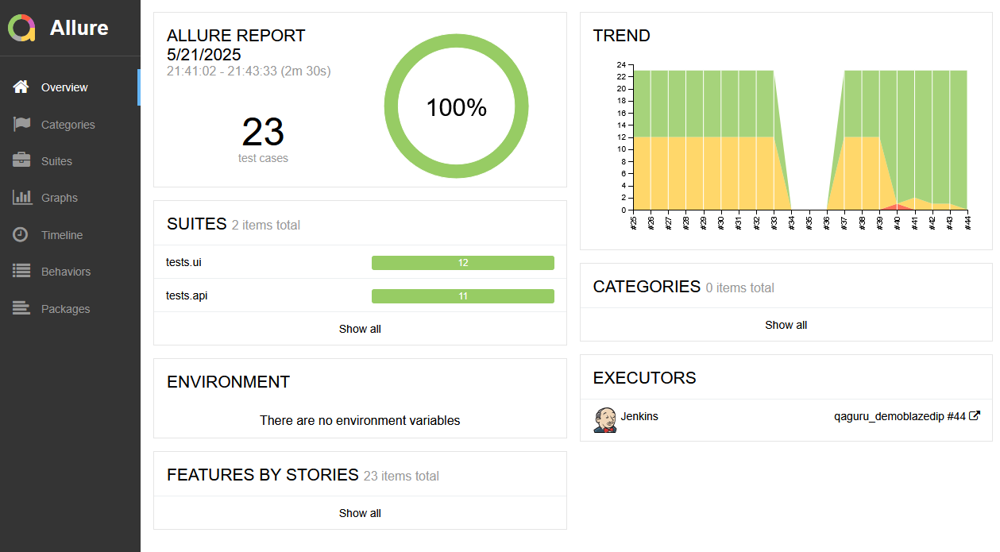
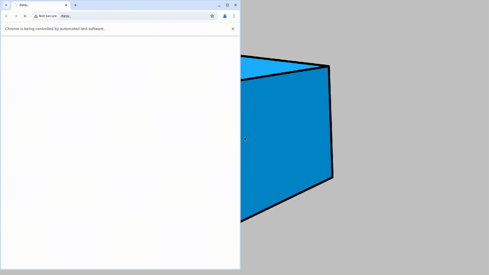
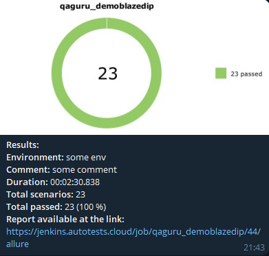
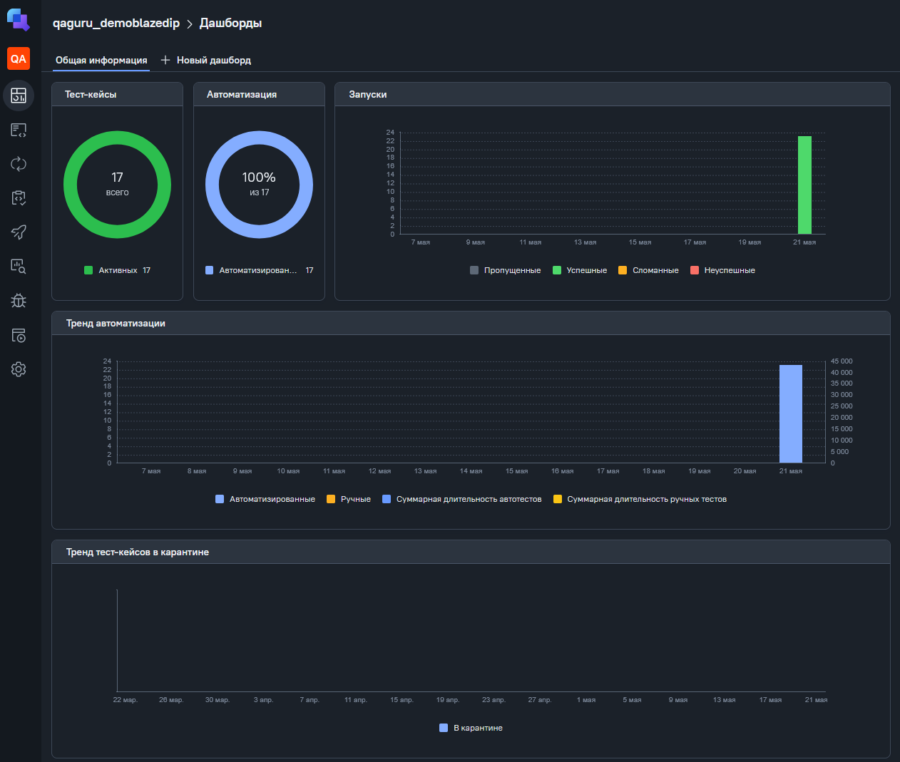
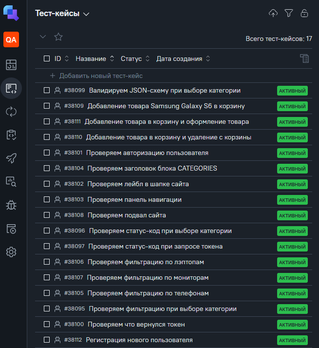
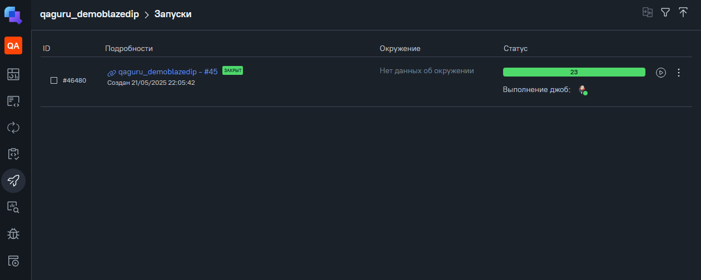

# Демонстрационный проект по тестированию UI и API сайта <a target="_blank" href="https://www.demoblaze.com">Product Store</a>


## Проект реализован с использованием:

- Дипломный проект выполнен на языке: `Python`
- Для написания UI-тестов используется фреймворк `Selene`, современная «обёртка» вокруг `Selenium WebDriver`
- Библиотека модульного тестирования: `PyTest`
- `Jenkins` выполняет удаленный запуск тестов в графическом интерфейсе. Установки дополнительных приложений на компьютер пользователя не требуется.
- Фреймворк`Allure Report` собирает графический отчет о прохождении тестов
- После завершения тестов `Telegram Bot` отправляет в `Telegram` краткий вариант Allure Report

## Для запуска тестов локально необходимо:
Клонировать репозиторий и перейти в него в командной строке:
```
https://github.com/rybkanotdead/qaguru_diplomUI.git
```
```
cd qaguru_dimplom
```
Создать и активировать виртуальное окружение:
```
python3 -m venv venv
```
- Если у вас Linux/macOS
    ```
    source venv/bin/activate
    ```
- Если у вас Windows
    ```
    source venv/scripts/activate
    ```
Обновить pip:
```
pip install --upgrade pip
```
Установить зависимости из файла requirements.txt:
```
pip install -r requirements.txt
```
Создать и заполнить .env файл, например:
```
touch .env
```
```
echo ENVIRONMENT='local' >> .env
```
```
echo USER_LOGIN='any_login' >> .env
```
```
echo USER_PASSWORD='any_password' >> .env
```
```
echo API_PASSWORD='any_api_password' >> .env
```
Запустить тесты:
```
pytest .
```
##  Jenkins
[](https://jenkins.autotests.cloud/job/qaguru_demoblazedip/49/allure/)
<details><summary>Результат выполнения</summary></details>
<br>
<details><summary>Общая информация</summary>
<br>

</details>
<details><summary>Тест-кейсы</summary>
<br>

</details>
<details><summary>Видео прохождения тест-кейса</summary>
<br>
</details>
<details><summary>Уведомление в telegram</summary>
<br>

</details>

##  Allure TestOps

[](https://allure.autotests.cloud/project/4763/dashboards)
<details><summary>Общая информация</summary>
<br>

</details>

<details><summary>Тест-кейсы</summary>
<br>

</details>

<details>
  <summary>История запусков</summary>
  <p>
    
  </p>
</details>
