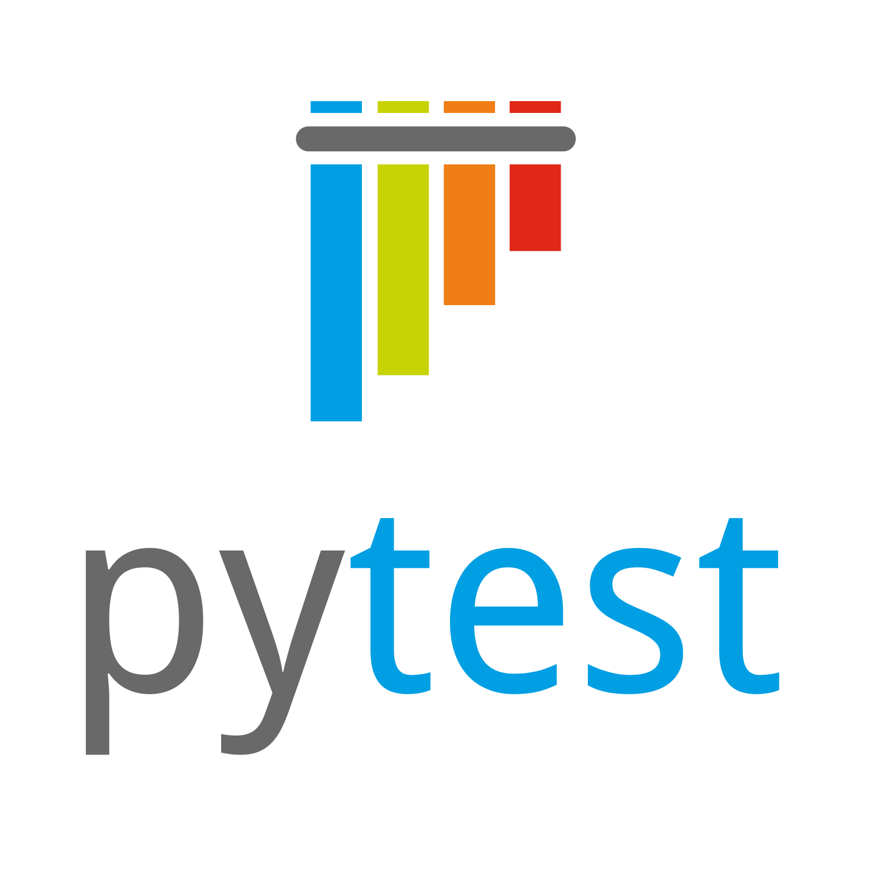
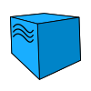

# Демонстрационный проект по тестированию UI и API сайта <a target="_blank" href="https://www.demoblaze.com">Product Store</a>


## Стек технологий:


## Для запуска тестов локально необходимо:
Клонировать репозиторий и перейти в него в командной строке:
```
https://github.com/rybkanotdead/qaguru_diplomUI.git
```
```
cd qaguru_dimplom
```
Создать и активировать виртуальное окружение:
```
python3 -m venv venv
```
- Если у вас Linux/macOS
    ```
    source venv/bin/activate
    ```
- Если у вас Windows
    ```
    source venv/scripts/activate
    ```
Обновить pip:
```
pip install --upgrade pip
```
Установить зависимости из файла requirements.txt:
```
pip install -r requirements.txt
```
Создать и заполнить .env файл, например:
```
touch .env
```
```
echo ENVIRONMENT='local' >> .env
```
```
echo USER_LOGIN='any_login' >> .env
```
```
echo USER_PASSWORD='any_password' >> .env
```
```
echo API_PASSWORD='any_api_password' >> .env
```
Запустить тесты:
```
pytest .
```